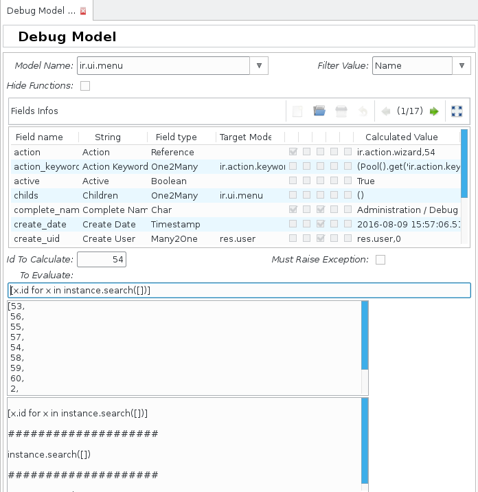
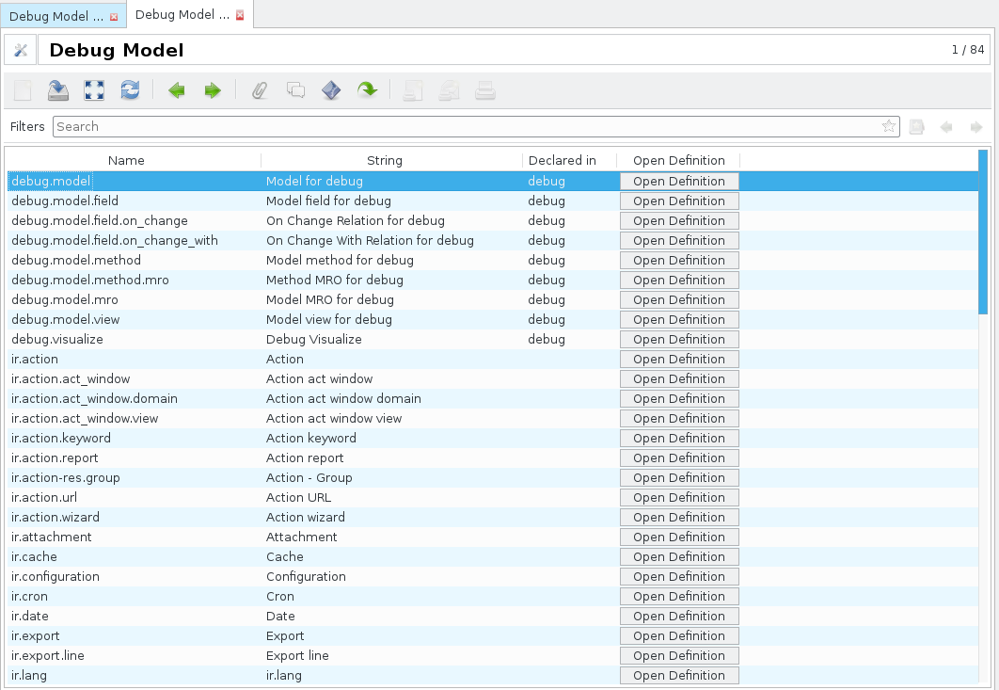
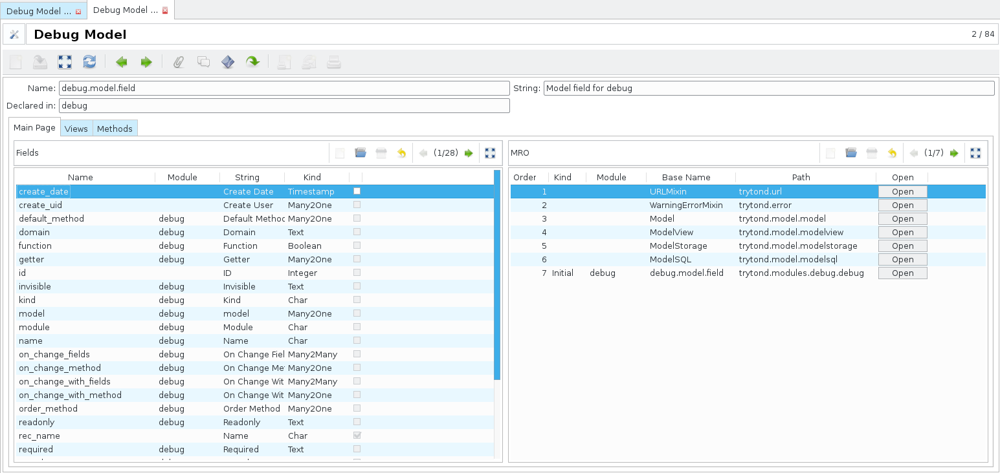
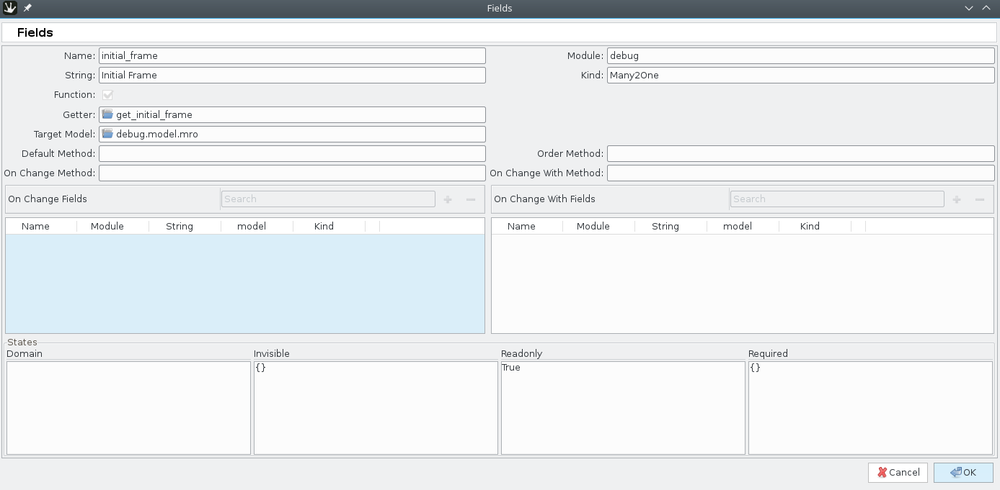
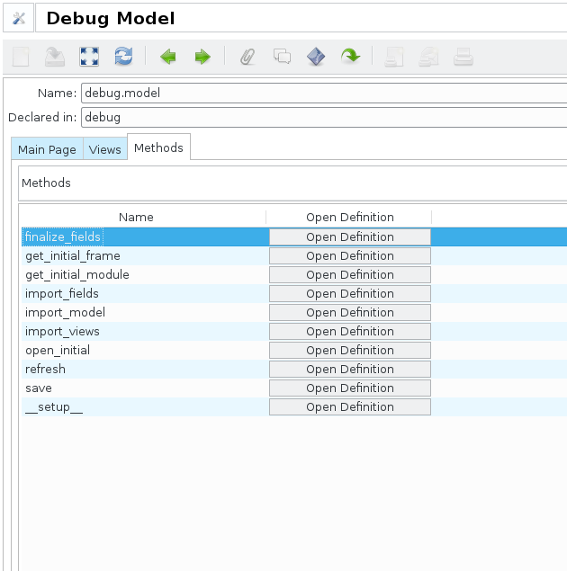
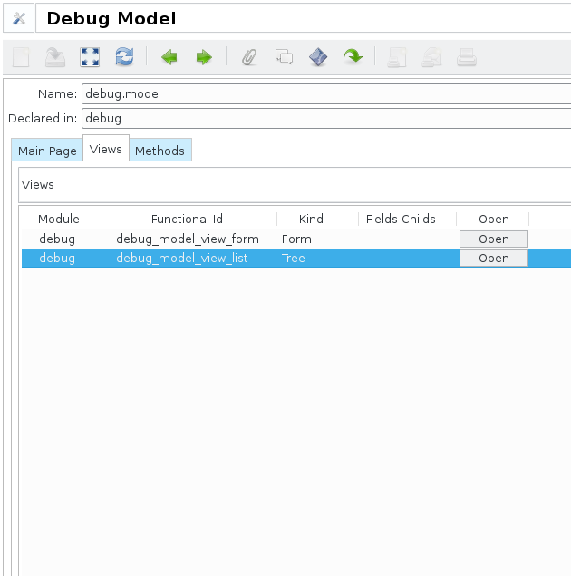
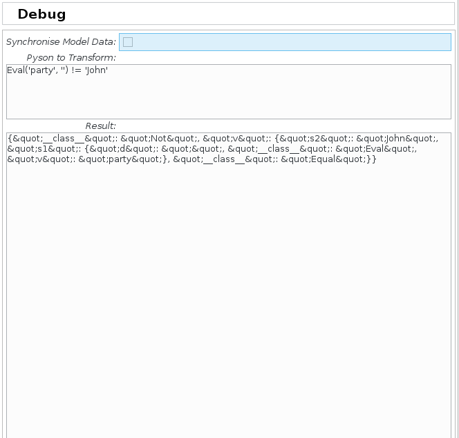

## Trytond Debug

This modules provides some tools to help developpers with
[tryton](http://www.tryton.org). Its main features are :
- Code execution for testing purpose
- Model introspection depending on installed modules (accessible from the
client or from APIs)
- Some helpers methods (pyson conversion, model data synchronisation,  etc...)

**WARNING : This module should not be installed in a production environnment,**
**since it does not include access right management, and gives access to some**
**tryton internals that should not be available to the end user.**

### Code execution

The modules adds a `Debug Instance` entry point. This entry point opens a
wizard, in which one can select a record (from **any** model). It will then
display all the fields and their value for this record, as well a some
characteristics of the fields.

It will also allow the user to evaluate arbitrary expressions based on this
instance, using a text field. For instance, one could write:

```python
instance.search([('id', '>', 10)])
```

This would output the list of instances which match the search criterion.

Note that the code will be executed in a rollbacked transaction. However, it is
still not safe, and this is one of the main reason the module should not be
installed in a production environnment.



### Model introspection

Since the model inheritance tree is not hardcoded but dynamically computed
depending on the database and the modules installed, understanding what is the
code that is actually used when only half of the modules are installed may be
tedious.

The introspection part of this module computes and stores a detailed
description of all models associated to the current database. This description
includes fields, views, and methods. For models and methods, the execution
**mro** is also displayed, to better understand the way the code flows when
executing some actions.

_Note 1_ : Most **__mro__** like models have a `Open` button which will use
`$EDITOR` to open the definition of the associated data (be it model, method or
view). By default only the file is opened, but it is possible to customize the
behaviour to jump to the proper location if the editor allows it (done with
**Neovim**).

_Note 2_ : The full data structure can be queried through a RPC call and
returned as JSON. This can be used to provide autocompletion when writing
modules.

#### Model data

The *Model* part of the module displays:
- The model's string
- The model's `__name__`
- The module in which the model was declared
- The list of fields
- The list of methods
- The list of views
- The `__mro__` for the model





#### Field data

The *Field* part includes:
- The field's name
- The field's type
- The field's string
- Whether the field is a function field or not
- States, domain (which includes all `__setup__` modifications)
- Links to methods, depending on the field's characteristics (getter / setter
method for function fields, default method, order method)
- Links to `on_change_(with_)` methods, as well as the list of the `depends`
fields



#### Method data

The *Method* data are rather limited, they mainly exist to view the **__mro__**
of a method, and detect if and where there may be overrides altering the base
behaviour.



#### View data

The *View* data are presented as a tree with all views and their overrides if
they exist. The main purpose is precisely to view how a given view was altered
by different modules.



### Helpers methods

There is a `Debug` wizard which offers some tools:
- *PYSON* conversion : converts a python *PYSON* string to a JSONified version
- Model Data synchronisation : Triggers a synchronisation of model data between
the filesystem and the database



### Better names for profiling

If the [post init hook patch](https://github.com/coopengo/trytond/commit/e68b71f)
is installed on trytond, the module will patch model / field methods at runtime
to help with traceback / profiling interpretation.

A typical configuration will be :

```conf
[debug]
methods=read,_validate,search,create,delete
fields_methods=get,set
```

This will dynamically modify the pool classes to rename methods according to
their related models / fields.

For instance, instead of a profiler output like :

```
ncalls  tottime  percall  cumtime  percall filename:lineno(function)
     10   5.000    0.500    4.000    0.400 function.py:XXX(get)
     10   5.000    0.500    1.000    0.100 modelsql.py:XXX(create)
```

You may have something like :

```
ncalls  tottime  percall  cumtime  percall filename:lineno(function)
     10   5.000    0.500    4.000    0.400 function.py:XXX(get)
     10   5.000    0.500    1.000    0.100 modelsql.py:XXX(create)
      2   4.000    2.000    3.000    1.500 <string>:1(create__account_move)
      4   4.000    1.000    0.500    0.125 <string>:1(__field_get_account_move__rec_name)
      8   1.000    0.125    1.000    0.125 <string>:1(create__account_move_line)
      6   1.000    0.133    0.500    0.088 <string>:1(__field_get_account_move_line__amount)
```

This should only be used for debugging complex tracebacks or for profiling,
since it slows down the application a little, and relies on unsafe code
injection at runtime.

### Installation

See **INSTALL**

### Copyright

See **COPYRIGHT**

### License

See **LICENSE**
